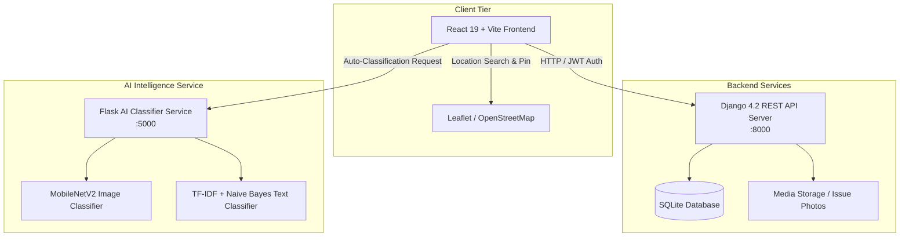

# FixMyCity - Ahmedabad Civic Issue Reporting & Management Platform

**FixMyCity** is an end-to-end civic engagement and issue tracking application pre-configured specifically for **Ahmedabad, Gujarat, India**. The platform empowers citizens to report urban issues (such as potholes, water leakage, power outages, and improper garbage disposal) with automatic AI category classification, location geofencing, and real-time status tracking.

---

## 📐 Platform Architecture

The project follows a decoupled multi-tier service architecture:



---

## 🛠️ Technology Stack

### 1. Frontend Client (`/frontend`)
- **Framework**: React 19 + Vite
- **Routing**: React Router v7
- **HTTP Client**: Axios with JWT Interceptors (`API.js`)
- **Interactive Maps**: Leaflet + React-Leaflet
- **Geocoding & Location**: OpenStreetMap / Nominatim API with Ahmedabad bounding box constraint
- **Design System**: Vanilla CSS Modules with Glassmorphism aesthetic, Inter font, custom dark/light color tokens, smooth micro-animations, and full responsive design

### 2. Core Backend API (`/backend`)
- **Framework**: Django 4.2 + Django REST Framework (DRF)
- **Authentication**: JWT Auth via `rest_framework_simplejwt` (Access & Refresh tokens)
- **Database**: SQLite (`db.sqlite3`)
- **Geofencing**: Strict coordinate validation against the Ahmedabad bounding box (`22.95°N - 23.12°N`, `72.45°E - 72.66°E`)
- **Seeding Command**: Custom management command `python manage.py seed_ahmedabad` to populate municipal departments and realistic seed issues

### 3. AI Classifier Service (`/ai_service`)
- **Framework**: Flask 2.3 + Flask-CORS + Werkzeug 2.3
- **Computer Vision**: TensorFlow / Keras `MobileNetV2` pretrained on ImageNet, with label mapping to civic categories (`roads`, `water`, `electricity`, `sanitation`, `other`)
- **Natural Language Processing**: Scikit-Learn `TfidfVectorizer` + `MultinomialNB` trained on civic problem text domain data
- **Multimodal Fusion**: Weighted prediction engine combining image recognition (60% weight) and text analysis (40% weight) to suggest categories automatically

---

## 📁 Repository Structure

```
fixmycity/
├── ai_service/                  # AI Classification Microservice
│   ├── app.py                   # Flask server, MobileNetV2 & NLP classifier logic
│   ├── test_ai_endpoints.py     # Endpoint verification test suite
│   ├── requirements.txt         # Dependencies (Flask, CORS, TensorFlow, Scikit-Learn)
│   └── .env                     # Configuration file
├── backend/                     # Django Core Backend API
│   ├── fixmycity_backend/       # Django project settings & root URLs
│   ├── issues/                  # Issue reporting app (models, serializers, views)
│   ├── departments/             # Municipal departments app
│   ├── users/                   # Authentication & custom user profiles
│   ├── manage.py                # Django CLI tool
│   └── requirements.txt         # Backend Python dependencies
├── frontend/                    # React + Vite Web Application
│   ├── src/
│   │   ├── components/          # Shared components (Navbar, Home sub-components)
│   │   ├── pages/               # Page components (Home, Login, Register, SubmitIssue, IssueTracking, AdminDashboard)
│   │   ├── services/            # API client (`api.jsx`) & Geocoding (`geocoding.jsx`)
│   │   ├── App.jsx              # Routing & auth state sync
│   │   ├── index.css            # Global CSS design tokens & animations
│   │   └── main.jsx             # React entry point
│   ├── index.html               # Main HTML template
│   ├── package.json             # NPM dependencies & scripts
│   └── vite.config.js           # Vite server configuration
├── docs/                        # Flow diagrams and project documentation
└── PROJECT.md                   # Complete system documentation (This file)
```

---

## ⚡ Core Features & User Workflows

### 1. Citizen Workflow
1. **Registration & Auth**: Users register an account and log in. Tokens are automatically stored in `localStorage`.
2. **Interactive Issue Submission (`/submit-issue`)**:
   - Title and detailed description entry.
   - Category selection (`Roads`, `Water`, `Electricity`, `Sanitation`, `Other`).
   - Image upload capability.
   - Interactive OpenStreetMap location picker with address search (bounded to Ahmedabad) and live GPS geolocation.
   - Client-side validation ensuring pins fall within Ahmedabad municipal boundaries.
3. **Issue Tracking (`/issues`)**:
   - Live view of citizen's reported issues.
   - Filter by status (`All`, `Pending`, `In Progress`, `Resolved`).
   - Visual status timeline step-by-step indicator (`Submitted` ➔ `In Progress` ➔ `Resolved`).

### 2. Department & Admin Workflow (`/admin`)
1. **Department Dashboard**: Dedicated dashboard for city administrators and municipal department leads.
2. **Key Metric Cards**: Quick stat breakdown of Total, Pending, In Progress, and Resolved complaints.
3. **Issue Table & Management**: Tabular overview with instant status update modals to transition issues across their lifecycle.

### 3. Smart AI Auto-Categorization
The AI microservice enables seamless issue classification:
- **`GET /health`**: Microservice status check.
- **`POST /classify-text`**: Classifies issue descriptions using NLP.
- **`POST /classify-image`**: Evaluates uploaded photos using MobileNetV2.
- **`POST /classify`**: Combines image vision and description text into a unified confidence score and category prediction.

---

## 🔌 API Endpoint Reference

### Auth Endpoints (`/api/`)
| Method | Endpoint | Description | Auth Required |
| :--- | :--- | :--- | :--- |
| `POST` | `/api/register/` | Register a new user profile | ❌ No |
| `POST` | `/api/login/` | Obtain JWT access and refresh tokens + role | ❌ No |

### Issue Endpoints (`/api/issues/`)
| Method | Endpoint | Description | Auth Required |
| :--- | :--- | :--- | :--- |
| `GET` | `/api/issues/` | List issues (filtered to Ahmedabad bbox) | ✅ Yes |
| `POST` | `/api/issues/` | Create new issue report (multipart/form-data) | ✅ Yes |
| `GET` | `/api/issues/{id}/` | Get details for specific issue | ✅ Yes |
| `PATCH` | `/api/issues/{id}/` | Update issue status/fields | ✅ Yes |

### AI Endpoints (`http://127.0.0.1:5000`)
| Method | Endpoint | Description | Payload Format |
| :--- | :--- | :--- | :--- |
| `GET` | `/health` | Service health status | N/A |
| `POST` | `/classify-text` | Classify issue description | `{ "description": "text" }` |
| `POST` | `/classify-image` | Classify base64 encoded photo | `{ "image": "base64..." }` |
| `POST` | `/classify` | Combined image & text prediction | `{ "image": "base64...", "description": "text" }` |

---

## 🚀 Setup & Execution Guide

### Prerequisites
- **Node.js**: v18+ and `npm`
- **Python**: v3.9+
- **Virtual Environment**: `venv`

### Step 1: Start Core Django Backend
```bash
# Navigate to backend directory
cd backend

# Activate your virtual environment (Windows example)
..\.venv\Scripts\activate

# Install dependencies
pip install -r requirements.txt

# Run migrations & seed Ahmedabad data
python manage.py migrate
python manage.py seed_ahmedabad

# Start Django Development Server (Default port 8000)
python manage.py runserver 0.0.0.0:8000
```

### Step 2: Start AI Classification Microservice
```bash
# Navigate to ai_service directory
cd ai_service

# Install AI service requirements
pip install -r requirements.txt

# Run Flask AI Server (Default port 5000)
python app.py
```

### Step 3: Run React Frontend
```bash
# Navigate to frontend directory
cd frontend

# Install Node modules
npm install

# Start Vite dev server (Default port 5173)
npm run dev
```

Visit `http://localhost:5173` in your browser to interact with FixMyCity Ahmedabad!

---

## 🔒 Security & Geofencing Policies

1. **Client-Side Geofencing**: Nominatim address searches use `viewbox=72.45,23.12,72.66,22.95&bounded=1`. Reverse geocoding validates coordinates against Ahmedabad bounds and alerts users if outside the city limit.
2. **Server-Side Boundary Defense**: The Django `IssueSerializer` validates coordinates against `22.95 <= lat <= 23.12` and `72.45 <= lon <= 72.66`, preventing API-level bypassing.
3. **CORS Security**: `flask-cors` is enabled on the AI Service to allow seamless cross-origin calls from the Vite dev server.
